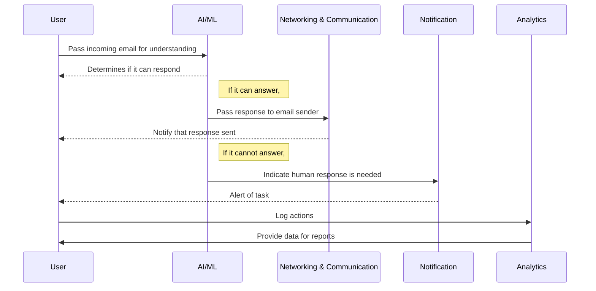
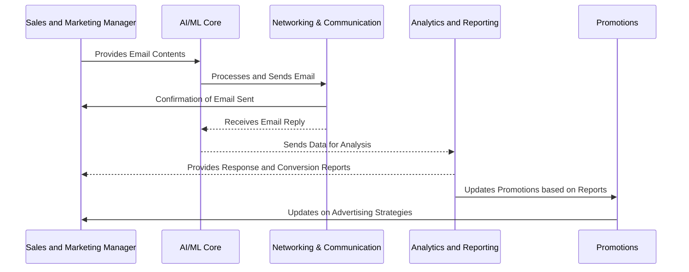
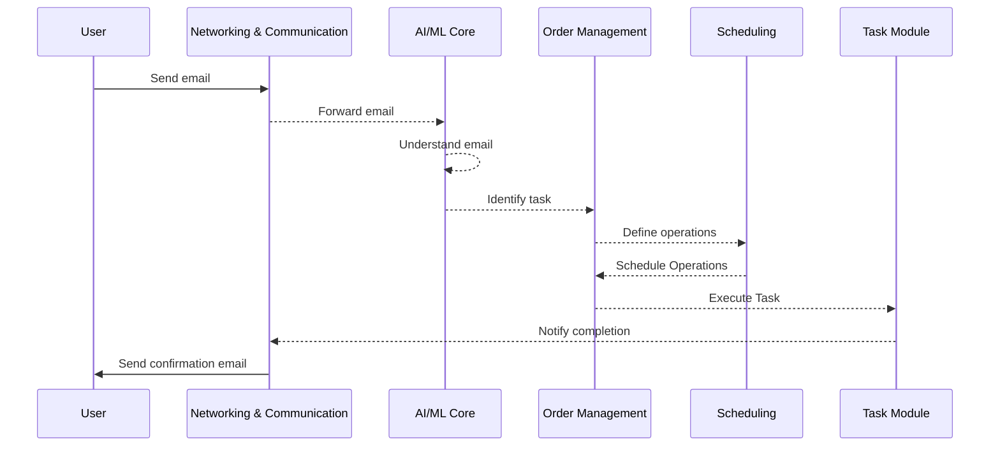
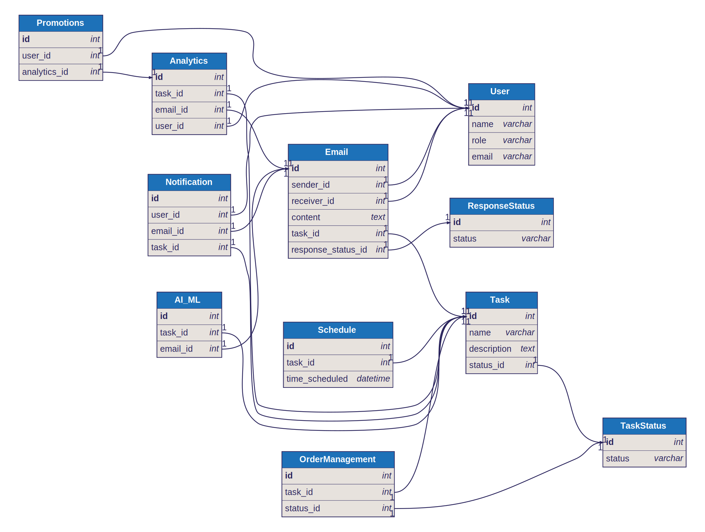

# GPT-I E

An automated AI mailbox for businesses that can read, understand, and respond to emails. It can be used to automate customer support, sales, and marketing, and also perform pre-setup tasks on behalf of the user.


## Project Capabilities
GPT-I offers the following capabilities:

- **Automation of email processing** - GPT-I is equipped with the ability to handle incoming emails, decipher their contents and respond aptly. It filters emails and responds based on priority, effectively reducing congestion and enhancing productivity.
- **Customer support automation** - GPT-I can understand customer queries, complaints, and requests, providing appropriate responses or escalations. This reduces the need for manual interventions, thus increasing efficiency.
- **Sales and marketing automation** - With GPT-I, you can automate email marketing campaigns, follow-ups, and process sales orders. It tracks user behavior, personalizes emails to individuals based on their interactions, and nurtures leads into conversions.
- **Pre-setup tasks automation** - GPT-I can perform pre-setup tasks on behalf of the user. This could include scheduling follow-up emails, setting up auto-responders and creating task-specific mailing lists.


## Project Modules
GPT-I is composed of the following modules:

- **Promotions** - GPT-I manages promotional emails by sending targeted content to specified user groups. It uses analytics to predict user need for personalized promotional emails.
- **Analytics and Reporting** - GPT-I tracks and analyzes all email activities, providing visual reports on campaign performance, customer behavior, and email responses. This empowers businesses with actionable insights.
- **AI/ML Core** - This is the heart of GPT-I, employing machine learning algorithms to read, understand, and respond to emails. It's capable of learning user behaviors and refining email communication over time.
- **Notification** - The notification module enables GPT-I to provide real-time alerts on received emails, completed tasks, and any system anomalies. This allows users to stay updated on key email activities.
- **Networking & Communication** - GPT-I handles all communication requirements providing an environment for efficient networking, enabling business users to establish and maintain email connections effortlessly.
- **Content Management** - Using GPT-I, businesses can manage email content, automate personalized email content creation, and ensure relevant content is delivered to the correct recipients.
- **Scheduling** - GPT-I has a scheduling functionality that allows for timed execution of tasks such as sending emails at a specified time or setting reminders for follow-up emails.
- **Order Management** - GPT-I can automate order acknowledgements, updates, and follow-ups through email. It also tracks order status and provides real-time updates to customers.


## Detailed User Stories
GPT-I is composed of the following user stories:

### 
<details>
    <summary>Story 1: As a customer support representative, I want to automate response to common customer queries so that I can focus on high value tasks</summary>

- **Goal:** Improve customer support productivity and efficiency
- **Modules:** AI/ML Core, Networking & Communication, Notification, Analytics and Reporting

#### Workflow
User Story Goal: Improve customer support productivity and efficiency

Goal Oriented Code Development Workflow:
1. AI/ML Core: Develop an AI/ML module that can effectively read and understand the content of incoming emails.
2. Networking & Communication: Implement functionality to automatically send responses to the sender of the email. The response content should be based on the understanding of the AI/ML module.
3. Notification: As part of the automated process, generate notifications for the customer support representative whenever the AI module decides a human response is needed, or whenever the system gets a complex query email.
4. Analytics and Reporting: Collect and analyze data on the number of automatically answered emails, the number of emails requiring human interference, efficiency of the AI/ML module, etc. This data can be used to measure and improve the system over time.

After each development step, a corresponding set of tests should be performed to ensure the functionality of each module.

#### Sequence Diagram

    
#### Milestones

#### Develop AI/ML Core
- Design an optimal AI learning model that fits the requirement of understanding emails content

- Code the AI/ML module based on designed architecture

- Test the AI/ML core module with various sample emails content to ensure it works correctly


#### Develop Networking and Communication
- Build a system that uses the outputs of AI/ML Core to automatically send replies to email senders

- Incorporate the ability for the system to send and receive emails

- Ensure the response and email communication systems work correctly and reliably


#### Develop Notification System
- Design a system that will trigger notifications based on AI/ML core outputs

- Link the notification system with AI/ML Core to receive necessary triggers

- Test scenarios to ensure notification system triggers correctly


#### Develop Analytics and Reporting
- Create a means to record and assess data related to automatic replies, human interactions, and AI/ML efficiency

- Build the analytics system according to the design and integrate with the rest of the modules

- Ensure the analytics and reporting systems record data accurately and generate correct reports


</details>
    

<details>
    <summary>Story 2: As a sales and marketing manager, I want to automate emailing prospects and tracking responses so that I can improve my conversion rate</summary>

- **Goal:** Increase sales and marketing efficiency
- **Modules:** AI/ML Core, Networking & Communication, Analytics and Reporting, Promotions

#### Workflow
1. Leverage the 'AI/ML Core' to parse emails, understand their content, and generate suitable responses.
2. Use 'Networking & Communication' to actually handle the sending and receiving of emails.
3. Extend 'Promotions' module to support automated emailing prospects and tracking conversions.
4. The 'Analytics and Reporting' module should keep track of responses and conversions, providing useful reports.
5. All modules should work together to improve conversion rates through efficient automated emailing and tracking.

#### Sequence Diagram

    
#### Milestones

#### Development of AI/ML Core Module
- Setting up the foundational environment where the AI/ML models will be trained and tested.

- Use a suitable dataset to train the AI model to understand the content of the emails.

- Develop the algorithm for the AI model to generate appropriate responses based on email content.


#### Implementation of Networking & Communication Module
- Code the functionality to send emails using an external service.

- Code the functionality to receive emails using an external service.


#### Extend Promotions Module
- Extend the existing Promotions module to be able to automatically email prospects.

- Add feature to keep track of successful conversions from email campaigns.


#### Integration of Analytics and Reporting Module
- Add feature to track responses and behaviour of recipients in reaction to sent emails.

- Create reports to summarize conversion rates, responses, and other useful measurements.


#### System Integration and Testing
- Integrate AI/ML Core, Networking & Communication, Promotions, and Analytics & Reporting modules to work together.

- Test the whole system to ensure all modules work together seamlessly, and the user story goal is met.


</details>
    

<details>
    <summary>Story 3: As a user, I want my pre-setup tasks to be automated so that I can focus on other important tasks</summary>

- **Goal:** Simplify routine tasks
- **Modules:** AI/ML Core, Networking & Communication, Order Management, Scheduling

#### Workflow
1. User input is received: The Networking & Communication module receives an email instructing it to carry out a pre-setup task.
2. Understand user input: The AI/ML Core uses natural language processing (NLP) to read, understand the email.
3. Identify and schedule task: The AI/ML Core identifies the task needed to be accomplished, the Order Management module defines the sequence of operations, then the Scheduling module schedules it.
4. Execute task: The appropriate module(in this case, the Order Management module) performs the task.
5. Send feedback: Once the task is performed, the Networking & Communication module sends an email in response to the initial email, notifying the user that the task has been completed.

#### Sequence Diagram

    
#### Milestones

#### Setting up the Communication & Networking module
- Implement functionality that allows the module to receive emails

- Implement functionality that allows the module to send emails


#### Implementing the AI/ML Core
- Develop the component of the AI/ML Core that understands natural language

- Develop a component that based on the data received from the NLP component can identify what tasks need to be performed


#### Implementing the Order Management Module
- Create functionality that defines the sequence of operations for each identified task.

- Develop the component that actually perform the tasks.


#### Implementing the Scheduling Module
- Develop a module that schedules tasks based on their sequence


#### Integration of all Modules
- Ensure proper communication and data transfer of all modules

- Setup a master control flow that correctly dictates which module is called at what time and in what order

- After tasks are executed, ensure that feedback is sent back to the user through the Networking & Communication module


</details>
    

  
## Project Models
GPT-I is composed of the following models:

- **User** - This model stores the user's details including name, role, and email. It serves as a reference for other models.
- **Email** - The Email model archives all incoming and outgoing emails associated with tasks and response status.
- **ResponseStatus** - This model keeps track of the email response status. This is helpful for identifying emails that require immediate attention.
- **Task** - The Task model manages individual tasks associated with emails from their initiation to completion.
- **TaskStatus** - This model monitors and logs the status of tasks to track progress.
- **Analytics** - The Analytics model stores data related to task and email analytics for reporting purposes.
- **Notification** - The Notification model handles all notifications related to emails and tasks for users.
- **AI_ML** - This model manages the data processed by the AI/ML Core. It links tasks and emails with AI processing.
- **Schedule** - The Schedule model handles all task scheduling records, allowing for timely task execution.
- **OrderManagement** - This model manages the status and updates related to orders processed via email.
- **Promotions** - The Promotions model manages data related to promotional campaigns and uses analytics for targeting.

  
## Entity-Relationship Schema Diagram


## Entity-Relationship Diagram
```mermaid
erDiagram
  User {
    int id
    string name
    string role
    string email
  }
  Email {
    int id
    User sender_id
    User receiver_id
    string content
    Task task_id
    ResponseStatus response_status_id
  }
  ResponseStatus {
    int id
    string status
  }
  Task {
    int id
    string name
    string description
    TaskStatus status_id
  }
  TaskStatus {
    int id
    string status
  }
  Analytics {
    int id
    Task task_id
    Email email_id
    User user_id
  }
  Notification {
    int id
    User user_id
    Email email_id
    Task task_id
  }
  AI_ML {
    int id
    Task task_id
    Email email_id
  }
  Schedule {
    int id
    Task task_id
    datetime time_scheduled
  }
  OrderManagement {
    int id
    Task task_id
    TaskStatus status_id
  }
  Promotions {
    int id
    User user_id
    Analytics analytics_id
  }
  
  User "1" -- "0..*" Email
  User "1" -- "0..*" Notification
  User "1" -- "0..*" Promotions
  User "1" -- "0..*" Analytics
  
  Email "1" -- "0..*" Notification
  Email "1" -- "0..*" AI_ML
  Email "1" -- "0..*" Analytics
  Email -- ResponseStatus
  
  Task "1" -- "0..*" Email
  Task "1" -- "0..*" Notification
  Task "1" -- "0..*" AI_ML
  Task "1" -- "0..*" Analytics
  Task "1" -- "0..*" Schedule
  Task "1" -- "0..*" OrderManagement
  
  TaskStatus -- Task
  TaskStatus -- OrderManagement
  Analytics -- Promotions

```


